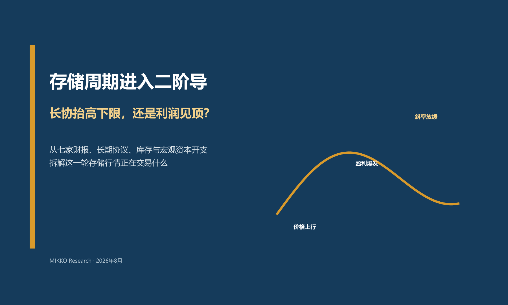
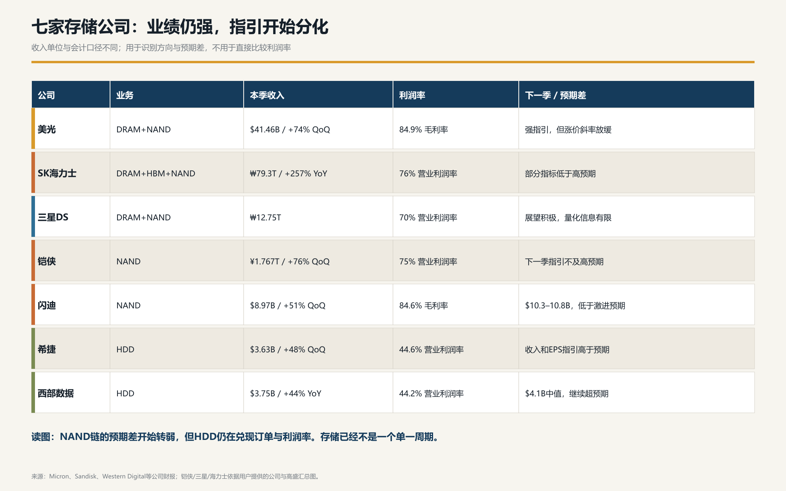
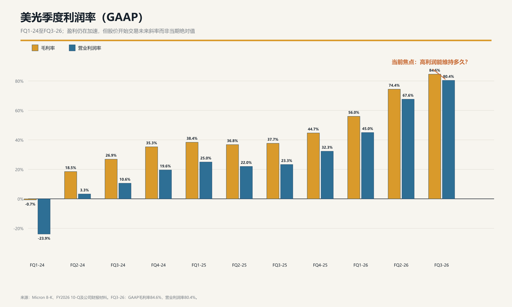
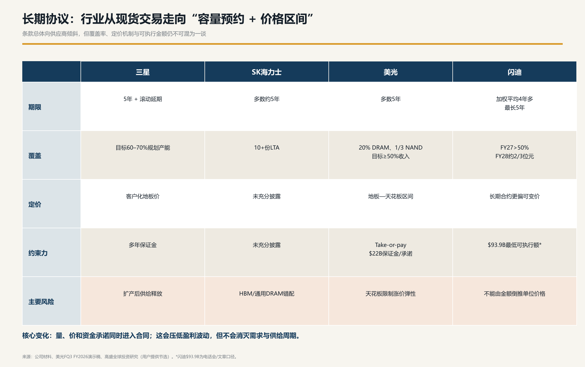
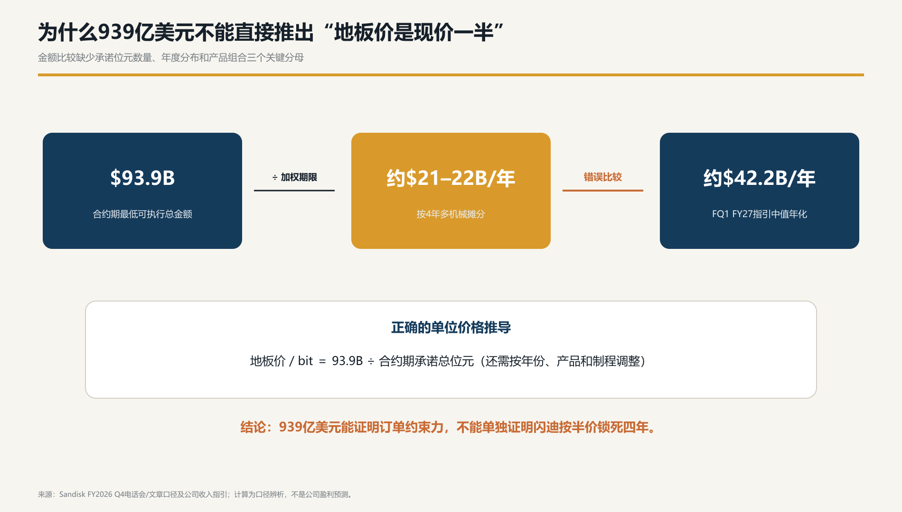
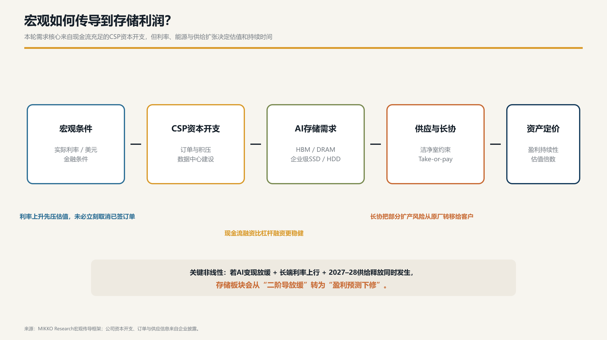
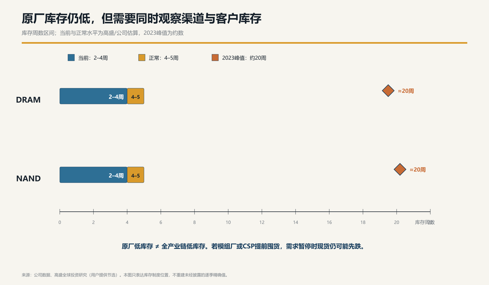
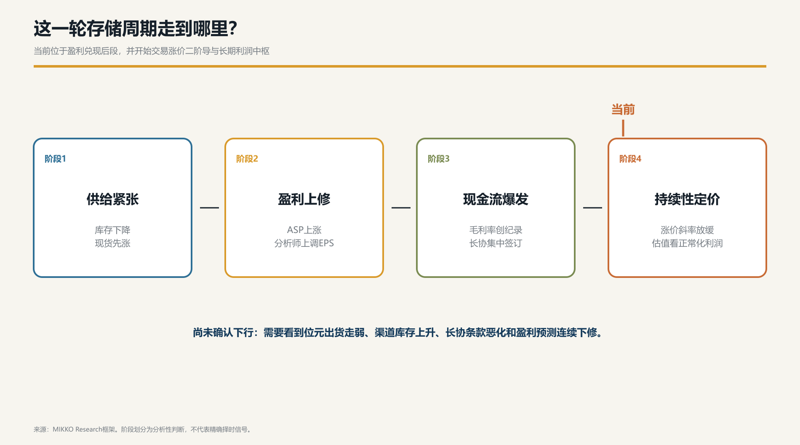

# 存储周期进入二阶导：长协抬高下限，还是利润见顶？

## 核心结论

昨晚西部数据与闪迪交出最新财报后，这一轮主要存储厂商的业绩基本出齐。表面上看，七家公司都交出了创纪录的收入或利润率；但真正值得重视的不是“纪录”，而是下一季指引已经开始分化。

这意味着存储板块的交易逻辑正在发生变化：前一阶段交易的是现货涨价、盈利上修和利润率爆发；现在开始交易涨价还能持续多久、长期协议锁住了多少利润，以及2027—2028年供给释放后，行业能否守住新的盈利中枢。

我的判断是：

1. 存储基本面仍强，尚未确认进入下行周期。
2. 股价已经从交易一阶变量——价格和利润绝对增长，切换到交易二阶变量——涨价斜率和盈利预测上修速度。
3. 长期协议确实会抬高盈利下限，但不能据此认定周期已经消失。
4. 当前处于周期第三阶段后半段，正在向第四阶段的“持续性定价”过渡。

---

## 第一步：事实校准——七家都很强，但不是同一种强

从当期业绩看，原厂仍处于利润兑现阶段。

闪迪Q4 FY2026收入89.65亿美元，环比增长51%，增长中约三分之一来自销量、三分之二来自价格；GAAP毛利率达到84.6%。公司给出的下一季收入指引为103亿—108亿美元，同时新增5份NBM长期协议，累计达到10份。[闪迪Q4 FY2026 SEC财报附件](https://www.sec.gov/Archives/edgar/data/2023554/000162828026053346/sndkq4-26ex991xpressrelease.htm)

西部数据Q4 FY2026收入37.47亿美元，同比增长44%；非GAAP毛利率54.4%，经营利润率44.2%，下一季收入指引中值为41亿美元。其收入约89%来自云业务，说明Nearline HDD仍在受益于云与AI数据增长。[西部数据Q4 FY2026财报](https://investor.wdc.com/news-releases/news-release-details/wd-reports-fiscal-fourth-quarter-and-fiscal-year-2026-financial)

美光FQ3 FY2026的GAAP毛利率达到84.6%，营业利润率达到80.4%，盈利能力仍在快速上升。[美光FQ3 FY2026演示材料](https://investors.micron.com/static-files/2354ecda-77a0-4ddd-8462-a631eb491356)

但是，“七家创纪录”不能被理解成一个统一的存储周期：

- 美光、海力士和三星同时拥有DRAM、HBM与NAND业务；
- 闪迪和铠侠更接近纯NAND及企业级SSD逻辑；
- 西部数据和希捷现在主要交易HDD订单、单盘容量和云客户需求。

因此，HDD指引强不能直接证明NAND同样强；NAND指引低于预期，也不能直接证明AI存储需求已经转弱。现在出现的是子行业分化，而不是整个存储行业同步见顶。

---

## 第二步：预期差——为什么创纪录财报仍可能换来股价下跌

周期股的股价从来不是简单跟着当期利润走。决定股价的是：实际结果相对财报前预期有多大差距，以及未来盈利预测是否还能继续上调。

上一阶段，投资者主要追踪三个变量：

1. DRAM与NAND现货价格上涨；
2. 原厂库存下降；
3. 分析师连续上调收入、毛利率和EPS预测。

到了现在，绝对价格可能仍在上涨，但季度涨幅已经从极高水平回落。于是同一份财报会出现两个看似矛盾的事实：

- 企业当期利润创纪录；
- 股价却因为下一季增长斜率低于最激进预期而下跌。

这不是基本面立刻反转，而是定价函数发生变化：

> 前期股价交易“利润会涨到多高”，现在股价交易“高利润能维持多久”。

如果此前估值已经隐含价格连续大幅上涨，那么即使公司给出仍然非常强的增长，只要增长斜率放缓，边际买盘就可能减少。这就是所谓的二阶导阶段。

---

## 第三步：传导机制——长协到底改变了什么

这一轮最重要的结构变化，是存储正在从现货主导的交易模式，向“容量预约、价格区间和资金承诺”并存的模式发展。

美光披露的16份SCA通常为五年期，覆盖约20%的DRAM数量和三分之一的NAND数量。协议采用take-or-pay结构，部分合同带地板价和天花板价；美光预计获得约220亿美元保证金及相关财务承诺。对于带价格区间的协议，公司表示地板价对应的毛利率仍高于过去任何一个周期的季度峰值。

这说明客户购买的不仅是存储芯片，也是未来供货的确定性。客户愿意提供预付款，是因为AI基础设施的建设周期很长，一旦内存或存储短缺，GPU、服务器、网络和数据中心资产都可能无法及时投入使用。

对原厂而言，长协带来三个变化：

- 销量和现金流可见度提高；
- 客户取消订单的代价上升；
- 原厂可以更有把握地规划资本开支。

但它也有代价：

- 天花板价会限制极端短缺时的涨价弹性；
- 长协最终可能鼓励更多扩产；
- 客户集中度、合同重议和产品迭代风险上升。

所以更准确的描述不是“去周期化”，而是“部分合约化与盈利波动收窄”。这更接近LNG长约或晶圆产能预约，而不是完全稳定的订阅收入。

### 939亿美元不能直接理解成半价锁单

文章使用了一个很有吸引力但口径并不完整的计算：闪迪长期协议最低可执行金额939亿美元，按四年多摊分，每年约200多亿美元；而下一季收入指引年化约422亿美元，因此认为合同地板大约只有当前收入的一半。

问题在于，939亿美元只对应已经签约的部分位元，而422亿美元对应全公司、全部产品和全部客户的收入。二者分母不同。

真正需要计算的是：

> 合约隐含地板价/bit = 939亿美元 ÷ 合约期承诺总位元数量。

还要进一步按照年度、产品、制程和客户结构调整。缺少承诺位元这一关键分母，就不能证明闪迪按照当前价格的一半锁死了四年。

同时，不能把闪迪的939亿美元最低执行金额与美光的合约毛利率表述直接拼接，再推出“整个行业的周期底部已经高于上一轮顶部”。两家公司产品结构、成本、合同覆盖率与资本开支完全不同。

---

## 宏观层：本轮为什么比传统消费电子周期更有韧性

传统存储周期往往由PC、手机和渠道补库存推动，需求容易受到居民消费、利率和库存去化影响。本轮更重要的边际需求来自CSP和AI数据中心资本开支，资金来源也主要是大型科技公司的经营现金流，而不是高杠杆融资。

这使本轮周期具有更强的韧性：

1. CSP担心的不是短期采购价格，而是拿不到足够的高性能存储，导致昂贵的计算基础设施无法按时部署。
2. 预付款和take-or-pay把部分扩产风险从原厂资产负债表转移给客户。
3. HBM占用更多晶圆与封装资源，NAND与DRAM的洁净室和设备扩张又需要较长周期，供给无法立即响应。
4. AI训练向推理扩散后，需求从HBM进一步传导至普通服务器DRAM、企业级SSD和Nearline HDD。

但宏观条件仍然会通过两条路径影响板块。

第一条是估值路径：实际利率和美债长端收益率上升，会提高权益贴现率，优先压缩高估值与高预期公司的估值倍数。它未必立刻取消已经签署的订单，但会让股价更早交易2027—2028年的盈利正常化。

第二条是资本开支路径：如果AI收入、云业务增长和订单积压能够继续验证资本开支回报，存储需求可以保持；如果AI变现低于预期，CSP会先放缓下一轮数据中心和服务器扩张，而不是立即撕毁当前合同。

真正危险的并不是单一利率上升或单一产能扩张，而是三件事同时发生：

> AI变现放缓 + 长端利率上行 + 2027—2028年供给集中释放。

这时二阶导放缓才可能演变为盈利预测下修。

---

## 第四步：验证与证伪——库存和产能该怎么盯

原厂库存仍在2—4周附近，低于约4—5周的正常水平，也远低于2023年约20周的峰值。这说明物理供给目前仍紧，尚不支持“存储已经全面过剩”的判断。

但原厂低库存不等于全产业链低库存。需要同时观察：

- 原厂库存；
- 模组厂与分销渠道库存；
- CSP、服务器ODM、手机和PC客户库存；
- 现货价与合约价之间的价差。

如果模组厂或客户提前囤货，就可能出现“原厂库存低、渠道库存高”的组合。届时终端暂停采购，现货价格仍可能领先财报下跌。

产能也不能只看每月晶圆数量。真正决定供给的是有效位元增长，需要同时考虑制程迁移、层数增加、良率、产品组合和洁净室在DRAM与NAND之间的分配。需求突然走弱时，即使新厂还未投产，价格也可能提前测试合同地板。

---

## 周期位置：第三阶段后半段，向第四阶段过渡

可以把这一轮划分为四个阶段：

1. **供给紧张**：库存下降、现货价格先涨。
2. **盈利上修**：ASP上涨、分析师持续上调EPS。
3. **现金流爆发**：毛利率创纪录、长期协议集中签署。
4. **持续性定价**：涨价斜率放缓，市场开始评估正常化利润。

当前已经走到第三阶段后半段，并开始进入第四阶段。这意味着基本面仍然强，但“当期创新高”已经不再足以推动股价。股价需要看到新的证据：更高的长协地板、更高的订单覆盖率、2027年盈利继续上调，或者AI存储需求出现新的增量场景。

### 三种情景

**乐观情景：盈利平台化。** AI资本开支与云收入保持高增长，长协地板和覆盖率继续上移，供给释放慢于需求。结果是盈利峰值可能回落，但中枢远高于过去周期。

**基准情景：高位降速。** 价格继续上涨但季度涨幅下降，长协锁住部分利润，非合约业务逐步正常化。企业盈利仍强，但估值从追逐峰值转为给持续性定价。

**悲观情景：合同地板被测试。** AI资本开支放缓、渠道库存上升、有效位元供给加速，现货价先跌并传导至新签合同；随后分析师连续下调2027—2028年盈利预测。

---

## 接下来最值得跟踪的五个指标

1. NAND与DRAM合约价格的季度涨幅，而不只是绝对价格。
2. 新签长协的地板、天花板、覆盖率、保证金和重议条款。
3. 原厂、模组厂和CSP三层库存是否出现背离。
4. CSP资本开支、订单积压以及云业务收入的增长速度。
5. 2027—2028年有效位元供给，而不只是晶圆厂名义产能。

## 最后的判断

这一轮存储行业确实出现了结构升级：长协、预付款和take-or-pay正在抬高现金流可见度，也可能显著抬高行业盈利底部。

但“下限抬高”不等于“周期消失”，“订单被锁定”也不等于“股价只能上涨”。目前股价反映的是涨价二阶导放缓和高预期消化，而不是已经确认的供给过剩。

一句话概括：

> 存储的第一阶段是赌价格，第二阶段是赌利润，第三阶段是赌现金流；现在进入的第四阶段，赌的是这些利润究竟能持续几年。

